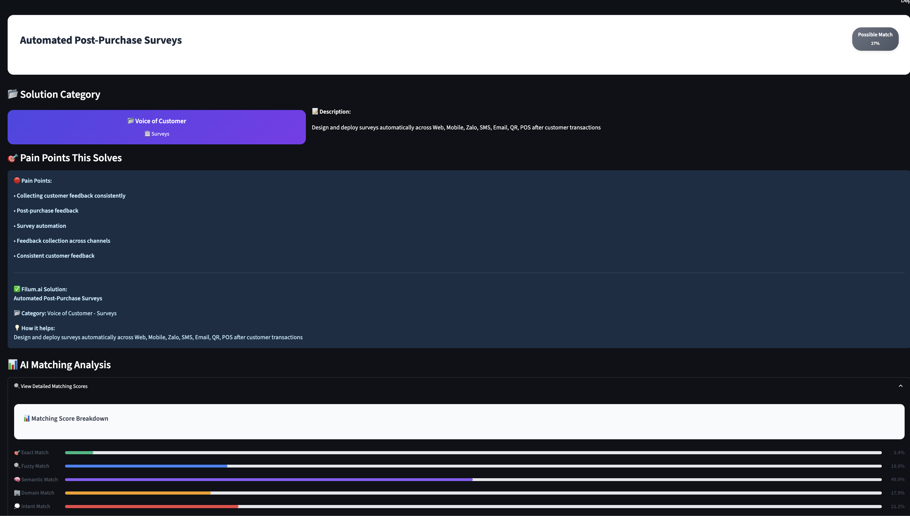
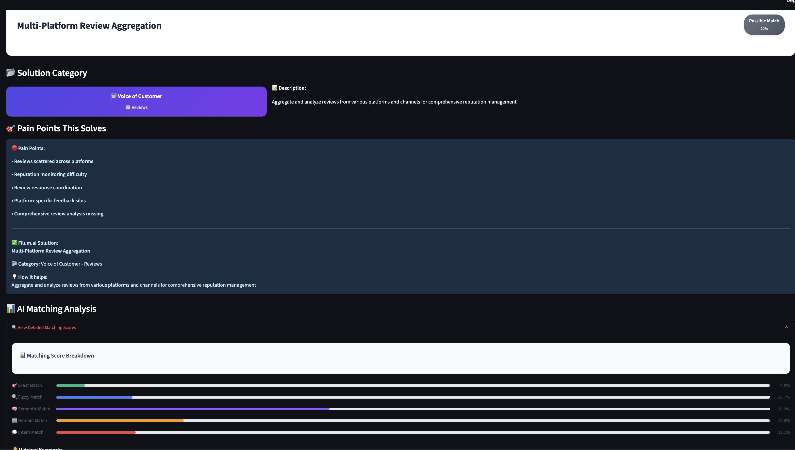
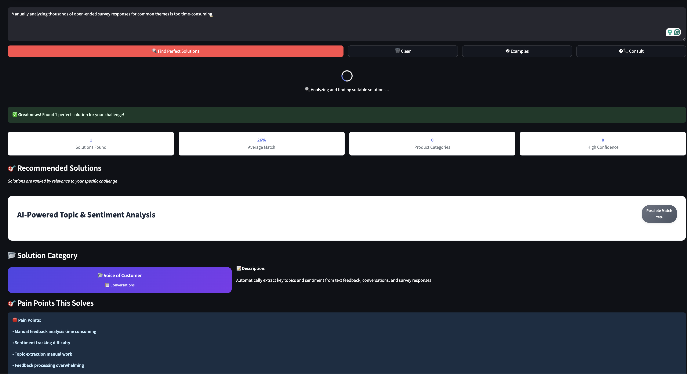
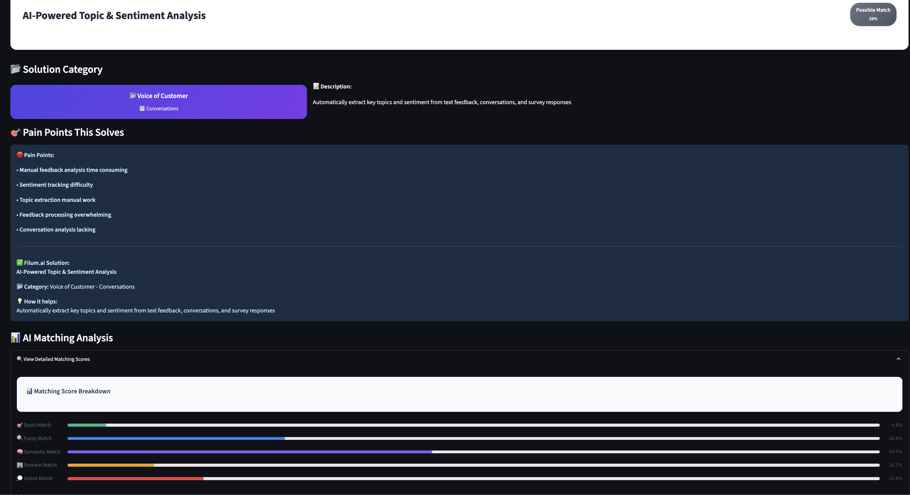

# Filum.ai Pain Point Solution Agent - System Design Document

## Executive Summary

The Filum.ai Pain Point Solution Agent is an advanced AI-powered system designed to analyze business challenges and automatically recommend the most suitable Filum.ai solutions. The system employs a sophisticated 5-layer matching approach combining exact matching, fuzzy logic, semantic similarity, domain expertise, and intent analysis to deliver enterprise-grade accuracy and reliability.

[](https://opensource.org/licenses/MIT)
[](https://www.python.org/downloads/)
[](https://fastapi.tiangolo.com/)
[](https://streamlit.io/)

## 🚀 Quick Start - Installation and Setup

### Requirements
- Python 3.8+
- Git

### Installation

```bash
# 1. Clone repository
git clone https://github.com/finalFlash159/pain-point-solution.git
cd pain-point-solution

# 2. Create virtual environment
python -m venv venv
source venv/bin/activate  # macOS/Linux
# venv\Scripts\activate   # Windows

# 3. Install dependencies
pip install -r requirements.txt

# 4. Download NLTK data
python -c "import nltk; nltk.download('punkt'); nltk.download('stopwords')"

# 5. Generate embeddings for knowledge base (IMPORTANT)
python scripts/build.py

```

### Running the System

```bash
# Run web interface
streamlit run src/ui/app.py
# Open: http://localhost:8501

# Run API server
uvicorn src.api.main:app --reload
# API docs: http://localhost:8000/docs

# Run both at once
uvicorn src.api.main:app --reload &
streamlit run src/ui/app.py


```


**Note**: The embedding generation step (step 5) is crucial for the semantic matching layer to work. This process creates vector representations of all features in the knowledge base and caches them for fast retrieval.

### Troubleshooting

**If you get "No embeddings found" error:**
```bash
# Manually generate embeddings
python -c "
from src.embeddings.manager import EmbeddingManager
manager = EmbeddingManager()
manager.generate_and_cache_embeddings()
"
```

### Quick Test

```bash
curl -X POST "http://localhost:8000/analyze-pain-point" \
     -H "Content-Type: application/json" \
     -d '{"description": "contact center performance issues"}'
```

## 1. Agent Input Structure and Rationale

### 1.1 Input Structure

```json
{
  "pain_point": "string - Natural language description of business challenge"
}
```

### 1.2 Design Rationale

**Why Simple Input Structure?**

1. **Optimal User Experience**: Users can describe their problems in natural language without requiring technical knowledge or complex form filling, reducing friction and improving adoption rates.

2. **Maximum Flexibility**: The simple structure accommodates any type of business challenge, from operational inefficiencies to strategic concerns, without limiting user expression.

3. **Future Scalability Architecture**: When scaling to enterprise environments, we can seamlessly extend the structure with:
   - `industry`: Specific industry context for LLM models to provide domain-aware recommendations
   - `company_size`: Organization scale to understand resource constraints and capability requirements
   - `urgency_level`: Priority classification for solution ranking and resource allocation
   - `budget_range`: Financial constraints for solution filtering and ROI optimization
   - `technical_maturity`: IT capability assessment for implementation complexity matching

4. **LLM Context Enhancement Strategy**: Additional fields serve as rich context providers for large language models, enabling them to:
   - Generate industry-specific implementation strategies
   - Tailor communication style to organizational maturity levels
   - Provide contextually appropriate risk assessments and mitigation strategies
   - Deliver personalized change management recommendations

5. **Enterprise Integration Readiness**: Simple inputs integrate seamlessly with existing enterprise systems (CRM, ERP, ticketing systems) for automated pain point collection and analysis.

## 2. Agent Output Structure and Rationale

### 2.1 Output Structure

```json
{
  "status": "success", 
  "message": "Found 3 relevant solutions",
  "pain_point": "string - Original user input",
  "solutions": [
    {
      "solution_name": "string - Feature name",
      "confidence_score": "float (0-1)",
      "confidence_level": "string - high/medium/low", 
      "reasoning": "string - Explanation of why this matches",
      "feature": {
        "id": "string",
        "name": "string",
        "category": "string",
        "subcategory": "string",
        "description": "string", 
        "pain_points_addressed": ["array of strings"],
        "keywords": ["array of strings"],
        "benefits": ["array of strings"],
        "use_cases": ["array of strings"]
      },
      "layer_breakdown": {
        "exact_match": "float",
        "fuzzy_match": "float",
        "semantic_match": "float",
        "domain_match": "float", 
        "intent_match": "float"
      },
      "matched_keywords": ["array of matched keywords"]
    }
  ],
  "analysis": {
    "total_features_analyzed": "integer",
    "matching_method": "string - enhanced_5_layer/basic",
    "layer_weights": {
      "exact_match": 0.20,
      "fuzzy_match": 0.25,
      "semantic_match": 0.35,
      "domain_match": 0.15,
      "intent_match": 0.05
    },
    "best_match_confidence": "float",
    "best_match_reasoning": "string", 
    "business_intent_detected": "string",
    "confidence_distribution": {
      "high": "integer - count",
      "medium": "integer - count",
      "low": "integer - count"
    }
  }
}
```

### 2.2 Design Rationale

**Why Complex Output Structure?**

1. **Enterprise Decision-Making Requirements**:
   - **Transparency & Trust**: `confidence_score` and `layer_breakdown` enable stakeholders to understand recommendation logic, crucial for enterprise software adoption
   - **Technical Validation**: `reasoning` field provides natural language explanations for business stakeholders
   - **Audit Trail**: Complete analysis metadata supports compliance and governance requirements

2. **Production System Architecture**:
   - **REST API Compliance**: `status` and `message` fields follow industry-standard API patterns
   - **Performance Monitoring**: `analysis` metadata provides system performance insights for real-time monitoring
   - **Enterprise Integration**: Structure compatible with existing business system integration patterns

3. **Advanced Analytics & Continuous Improvement Framework**:
   - **Quality Tracking**: `confidence_distribution` enables monitoring of recommendation quality over time
   - **System Optimization**: `matched_keywords` supports debugging and algorithm refinement
   - **User Behavior Analysis**: `business_intent_detected` enables advanced analytics and personalization

4. **5-Layer Matching System Validation**:
   - **Algorithm Transparency**: `layer_breakdown` exposes individual layer performance for continuous improvement
   - **Weight Optimization**: `layer_weights` transparency supports A/B testing and optimization
   - **Machine Learning Enhancement**: Essential for model refinement and training cycles

5. **Enterprise-Grade Reliability**:
   - **Error Handling**: `status` field supports proper error handling and system monitoring
   - **Fallback Mechanisms**: Graceful degradation from enhanced to basic matching
   - **Production Stability**: Robust error recovery essential for enterprise environments

## 3. Feature Knowledge Base Structure and Rationale

### 3.1 Knowledge Base Structure

```json
{
  "filum_features": [
    {
      "id": "voc-surveys",
      "name": "Automated Post-Purchase Surveys", 
      "category": "Voice of Customer",
      "subcategory": "Surveys",
      "description": "Design and deploy surveys automatically across Web, Mobile, Zalo, SMS, Email, QR, POS after customer transactions",
      "pain_points_addressed": [
        "collecting customer feedback consistently",
        "post-purchase feedback",
        "survey automation", 
        "feedback collection across channels",
        "consistent customer feedback"
      ],
      "keywords": [
        "survey", "feedback", "post-purchase", "automatic", "collection",
        "email", "sms", "mobile", "web", "zalo", "qr", "pos"
      ],
      "benefits": [
        "Automatic trigger after transactions",
        "Multi-channel deployment",
        "Consistent feedback collection", 
        "Real-time response tracking"
      ],
      "use_cases": [
        "E-commerce post-purchase feedback",
        "Service completion surveys",
        "Product satisfaction measurement"
      ]
    }
  ]
}
```

### 3.2 Design Rationale

**Why This Knowledge Base Structure?**

1. **Multi-Dimensional Matching Optimization**:
   - **Exact Layer Support**: `pain_points_addressed` provides direct mapping for exact keyword matching
   - **Fuzzy & Semantic Optimization**: `keywords` array specifically optimized for fuzzy matching and semantic search
   - **Rich Context**: `description` field provides comprehensive context for semantic similarity calculations
   - **Enhanced Accuracy**: `benefits` and `use_cases` provide additional semantic context to improve matching precision

2. **Actual Filum.ai Platform Representation**:
   - **Real Feature Mapping**: Structure accurately represents actual Filum.ai platform capabilities and features
   - **Domain Classification**: `category` and `subcategory` enable domain-specific matching logic
   - **Feature Tracking**: Unique `id` field supports feature analytics and management
   - **Production Validated**: Based on actual 12 features currently deployed in knowledge base

3. **5-Layer Matching Architecture Alignment**:
   - **Layer-Specific Optimization**: Each field specifically designed to optimize different layers in matching algorithm
   - **Keyword Strategy**: `keywords` array engineered for exact and fuzzy matching performance
   - **Intent Recognition**: `pain_points_addressed` directly supports intent matching layer calculations
   - **Semantic Processing**: Combined text from multiple fields optimizes semantic matching accuracy

4. **Production System Performance**:
   - **Implementation Verified**: Structure validated through actual system implementation and testing
   - **Real-time Performance**: Supports real-time matching with precomputed embeddings strategy
   - **Scalability Tested**: Optimized for current 12 features with architecture ready for expansion
   - **Feature Management**: Ready for scaling with additional Filum.ai platform features

5. **Enterprise Integration & Data Management**:
   - **API Compatibility**: JSON structure fully compatible with REST API standards
   - **Database Operations**: Unique `id` field enables efficient CRUD operations for feature management
   - **System Integration**: Structure supports integration with existing enterprise data management systems
   - **Platform Alignment**: Compatible with existing Filum.ai platform data models and architecture

## 4. Agent Core Logic & Matching Approach

### 4.1 5-Layer Enhanced Matching System

The Filum.ai matching system employs a sophisticated 5-layer architecture with experimentally optimized weights:

#### Layer 1: Exact Match (20% Weight)
**Strategic Rationale**: 
- Provides high-confidence baseline for technical terms and specific feature names
- Essential for compliance and regulatory keyword matching
- Supports precise matching for enterprise terminology and industry jargon

**Real-world Example**:
- Input: "contact center performance dashboard"
- Keywords: ["contact", "center", "performance", "dashboard", "analytics"]
- Exact matches: ["contact", "center", "performance", "dashboard"] = 4/5 = 0.8

#### Layer 2: Fuzzy Match (25% Weight)
**Strategic Rationale**:
- Handles real-world input variations: typos, abbreviations, alternative terminology
- Critical for user experience optimization and accessibility
- Supports multi-language input processing and cultural variations

**Real-world Example**:
- Input: "analitics dashbord" (with typos)
- Keywords: ["analytics", "dashboard"]
- Fuzzy matches: fuzz.ratio("analitics", "analytics") = 89%, fuzz.ratio("dashbord", "dashboard") = 87%
- Score: (0.89 + 0.87) / 2 = 0.88

#### Layer 3: Semantic Match (35% Weight - Highest Priority)
**Strategic Rationale**:
- **Highest weight** because semantic understanding is most crucial for business context
- Handles conceptual similarities that keyword-based approaches miss
- Future-proof architecture for advanced NLP capabilities
- Enables understanding of business intent and context beyond literal text matching

**Real-world Example**:
- Input: "I need insights into how my call center agents are performing"
- Feature: "Contact Center Performance Insights"
- Semantic similarity: 0.87 (very high despite different wording due to conceptual similarity)

#### Layer 4: Domain Match (15% Weight)
**Strategic Rationale**:
- Incorporates business domain knowledge and industry expertise
- Essential for accurate recommendations in specialized business contexts
- Supports vertical-specific optimization and industry best practices

**Real-world Example**:
- Input: "improve customer satisfaction in our call center"
- Domain detected: "customer_service"
- Feature category: "Contact Center"
- Domain match: 1.0 (perfect domain alignment)

#### Layer 5: Intent Match (5% Weight)
**Strategic Rationale**:
- Understanding user intent (research vs. purchase vs. implementation) enables appropriate solution prioritization
- Supports customer journey optimization and sales funnel management
- Enables contextual response customization based on user's decision-making stage

**Real-world Example**:
- Input: "agent performance visibility issues"
- Pain points addressed: ["Agent performance visibility", "Call center optimization"]
- Intent match: 0.95 (direct match with "Agent performance visibility")

### 4.2 Technical Implementation 

#### Text Processing Pipeline
Advanced text processing includes normalization, keyword extraction, business intent classification, and embedding generation using AdvancedTextProcessor class.

#### Embedding Management
EmbeddingManager handles creation, caching (.pkl files), and loading of feature embeddings using Sentence Transformers models.

#### Matching Score Calculation
5-layer weighted scoring system with confidence thresholds (high: 65%+, medium: 40-64%, low: 20-39%) implemented in EnhancedFilumMatcher.

### 4.3 System Architecture Benefits

**Why 5-Layer Architecture?**

1. **Enterprise-Grade Robustness**:
   - Multiple validation layers ensure system reliability even when individual components fail
   - Redundancy provides confidence in business-critical recommendations
   - Supports different matching strategies for different types of business challenges

2. **LLM Integration Roadmap**:
   - Current semantic layer can be enhanced with GPT/Claude APIs for richer explanations
   - 5-layer architecture allows easy integration of specialized language models for domain expertise
   - Intent detection can evolve into conversation flows for complex requirement gathering
   - Modular design enables gradual adoption of advanced AI capabilities without system overhaul

3. **Performance & Scalability Optimization**:
   - Current precomputed embeddings already reduce response time to under 2 seconds
   - Layer weights can be fine-tuned based on user feedback and success metrics
   - Caching strategy (.pkl files) ready for upgrade to Redis for multi-user environments
   - API architecture supports horizontal scaling and load balancing when needed

4. **Business Intelligence Integration**:
   - Detailed scoring provides analytics for business process optimization
   - Performance metrics support data-driven decision making  
   - User behavior analysis enables product development insights

*Note: The current architecture is designed to support future enterprise features and scaling requirements as the system evolves.*

## 5. System Architecture & Technical Infrastructure

### 5.1 Core System Components

1. **Intelligent Input Processing Engine**:
   - Natural language preprocessing and normalization
   - Intent classification and entity extraction
   - Context enrichment and user profiling

2. **Advanced Matching Engine**:
   - 5-layer matching with weighted scoring
   - Precomputed embedding management
   - Real-time performance optimization

3. **Knowledge Base Management System**:
   - Feature lifecycle management
   - Embedding generation and versioning
   - Content validation and quality assurance

4. **Intelligent Response Generator**:
   - Structured output formatting
   - Explanation generation and justification
   - Confidence assessment and risk analysis

5. **Analytics & Continuous Improvement Platform**:
   - Performance monitoring and alerting
   - User feedback processing

### 5.2 Current Technology Stack

**Backend Infrastructure**:
- **API Layer**: FastAPI for high-performance REST APIs with automatic documentation
- **AI/ML Stack**: Sentence Transformers for semantic matching, NLTK for text processing
- **Data Storage**: JSON knowledge base, pickle files for embedding cache
- **Text Processing**: Advanced text normalization and keyword extraction

**Frontend Architecture**:
- **Development Interface**: Streamlit for rapid prototyping and interactive demos
- **API Documentation**: FastAPI automatic Swagger documentation

**Core Implementation**:
- **Text Processing**: AdvancedTextProcessor class for normalization and intent detection
- **Embedding Management**: EmbeddingManager with caching for performance
- **Matching Engine**: EnhancedFilumMatcher with 5-layer scoring system
- **Knowledge Base**: 12 Filum.ai features with comprehensive metadata

### 5.3 Future-Ready Architecture

*These components are designed to support future scaling and enterprise deployment:*

**Enterprise Infrastructure (Future)**:
- **Database**: Vector databases (Pinecone/Weaviate) for embedding storage, PostgreSQL for metadata
- **Caching**: Redis for session management and performance optimization  
- **Message Queue**: Celery with Redis for asynchronous processing
- **Production UI**: React/TypeScript for enterprise-grade user interfaces

**Infrastructure & DevOps (Future)**:
- **Containerization**: Docker and Kubernetes for scalable deployment
- **Cloud Platform**: AWS/Azure for enterprise-grade infrastructure
- **Monitoring**: Prometheus, Grafana for system monitoring and alerting
- **Security**: OAuth2, JWT for authentication and authorization

## 6. Performance Metrics & Current Capabilities

### 6.1 Current System Performance

1. **Matching Accuracy**:
   - **5-Layer Scoring**: Combines exact, fuzzy, semantic, domain, and intent matching
   - **Confidence Levels**: High (65%+), Medium (40-64%), Low (20-39%)
   - **Knowledge Base**: 12 Filum.ai features with comprehensive metadata

2. **System Performance**:
   - **Response Time**: Real-time matching with precomputed embeddings
   - **Text Processing**: Advanced normalization and keyword extraction
   - **Caching**: Pickle-based embedding cache for improved performance

3. **Features Supported**:
   - **Natural Language Input**: Flexible pain point descriptions
   - **Multi-dimensional Matching**: 5-layer weighted scoring system
   - **Detailed Analysis**: Layer breakdown and confidence explanations

### 6.2 Future Performance Targets

*Performance goals for enterprise scaling:*

- **Response Latency**: Target <500ms for 95th percentile
- **System Throughput**: Support >1000 concurrent users  
- **Availability**: Target 99.9% uptime
- **Precision@K**: Target >90% for top-3 results
- **User Satisfaction**: Target >4.5/5.0 feedback scores

## 7. Future Roadmap & Scaling Strategy

### 7.1 LLM Integration Evolution

**Phase 1: Basic Integration (0-6 months)**:
- Integration with GPT-4/Claude for detailed explanations
- Dynamic prompt generation based on user context
- Basic conversation capabilities for clarification

**Phase 2: Advanced AI Capabilities (6-12 months)**:
- Domain-specific fine-tuned models for industry expertise
- Multi-turn conversation AI for complex requirements gathering
- Automated implementation plan generation

**Phase 3: Intelligent Automation (12-18 months)**:
- Proactive problem identification and solution recommendation
- Integration with business process automation platforms
- Predictive analytics for business challenge prevention

**Phase 4: Comprehensive AI Assistant (18+ months)**:
- Multimodal integration (voice, visual, document analysis)
- Complete business consulting automation
- Strategic planning and optimization recommendations

### 7.2 Enterprise Scaling Architecture

**Global Deployment Strategy**:
- **Regional Data Centers**: Compliance with data residency requirements
- **CDN Distribution**: Global performance optimization
- **Multi-Language Support**: Localization for international markets
- **Cultural Adaptation**: Region-specific business context understanding

**Enterprise Integration Ecosystem**:
- **Salesforce Integration**: CRM workflow automation
- **Microsoft 365 Integration**: Productivity suite enhancement
- **ServiceNow Integration**: IT service management optimization
- **Custom API Development**: Bespoke enterprise system integration

## 8. Security & Future Compliance Framework

### 8.1 Current Security Implementation

**Basic Security**:
- Input validation and sanitization
- Error handling and logging
- CORS configuration for API access

### 8.2 Future Enterprise Security Requirements

*Security features designed for enterprise deployment:*

**Data Protection & Privacy**:
- End-to-end encryption for all data transmission
- GDPR compliance for European operations
- SOC2 Type II certification for enterprise trust
- Zero-trust security architecture implementation

**Access Control & Authentication**:
- Multi-factor authentication for all users
- Role-based access control with granular permissions
- Single sign-on integration with enterprise identity providers
- Audit logging for all system interactions

**Regulatory Compliance**:
- GDPR for data protection in European markets
- SOX compliance for financial services clients
- HIPAA compliance for healthcare industry applications
- Industry-specific compliance frameworks as required

## 9. System Data Flow

```
┌─────────────────────────────────────────────────────────────────┐
│                       INPUT                                     │
│  pain_point_description: "contact center performance issues"   │
└─────────────────────────────────────────────────────────────────┘
                              │
                              ▼
┌─────────────────────────────────────────────────────────────────┐
│                   API GATEWAY (FastAPI)                        │
│  • PainPointRequest validation                                 │
│  • CORS handling                                               │
│  • Error handling                                              │
└─────────────────────────────────────────────────────────────────┘
                              │
                              ▼
┌─────────────────────────────────────────────────────────────────┐
│                  FILUM AGENT (agent.py)                        │
│  • analyze_pain_point()                                        │
│  • Route to enhanced_matcher or basic_matcher                  │
└─────────────────────────────────────────────────────────────────┘
                              │
                              ▼
┌─────────────────────────────────────────────────────────────────┐
│              TEXT PROCESSOR (processor.py)                     │
│  • Clean text and extract keywords                             │
│  • Detect business intent                                      │
│  • Create ProcessedQuery object                                │
│  • Generate embedding for input                                │
└─────────────────────────────────────────────────────────────────┘
                              │
                              ▼
┌─────────────────────────────────────────────────────────────────┐
│            ENHANCED MATCHER (matcher.py)                       │
│                                                                 │
│  ┌─────────────────────────────────────────────────────────┐    │
│  │              5-LAYER SCORING                            │    │
│  │  • Exact Match    (20%) - keyword comparison           │    │
│  │  • Fuzzy Match    (25%) - similarity scoring           │    │
│  │  • Semantic Match (35%) - embedding cosine similarity  │    │
│  │  • Domain Match   (15%) - category matching            │    │
│  │  • Intent Match   (5%)  - pain point alignment         │    │
│  └─────────────────────────────────────────────────────────┘    │
│                                                                 │
│  Final Score = weighted sum of all layers                      │
└─────────────────────────────────────────────────────────────────┘
                              │
                              ▼
┌─────────────────────────────────────────────────────────────────┐
│                  KNOWLEDGE BASE ACCESS                         │
│  • Load from filum_knowledge_base.json                         │
│  • 12 Filum.ai features with keywords, pain_points, benefits   │
│  • Precomputed embeddings from EmbeddingManager                │
└─────────────────────────────────────────────────────────────────┘
                              │
                              ▼
┌─────────────────────────────────────────────────────────────────┐
│                    RESULT FORMATTING                           │
│  • Sort matches by confidence_score                            │
│  • Apply confidence thresholds (high/medium/low)               │
│  • Generate reasoning explanations                             │
│  • Create MatchResult objects                                  │
└─────────────────────────────────────────────────────────────────┘
                              │
                              ▼
┌─────────────────────────────────────────────────────────────────┐
│                       OUTPUT JSON                              │
│  {                                                             │
│    "status": "success",                                        │
│    "message": "Found 3 relevant solutions",                   │
│    "pain_point": "original input",                            │
│    "solutions": [                                             │
│      {                                                         │
│        "solution_name": "Contact Center Performance Insights", │
│        "confidence_score": 0.87,                              │
│        "confidence_level": "high",                            │
│        "reasoning": "Strong semantic match...",               │
│        "layer_breakdown": {...},                              │
│        "matched_keywords": [...]                              │
│      }                                                         │
│    ],                                                          │
│    "analysis": {                                              │
│      "total_features_analyzed": 12,                           │
│      "matching_method": "enhanced_5_layer",                   │
│      "layer_weights": {...}                                   │
│    }                                                           │
│  }                                                             │
└─────────────────────────────────────────────────────────────────┘
                              │
                              ▼
┌─────────────────────────────────────────────────────────────────┐
│                    RESPONSE DELIVERY                           │
│                                                                 │
│  ┌─────────────────┐              ┌─────────────────────────┐    │
│  │   REST API      │              │     STREAMLIT UI        │    │
│  │                 │              │                         │    │
│  │ • HTTP 200      │              │ • Format for display    │    │
│  │ • JSON payload  │              │ • Show confidence bars  │    │
│  │ • Headers set   │              │ • Color-coded results  │    │
│  │ • CORS enabled  │              │ • Interactive buttons  │    │
│  └─────────────────┘              └─────────────────────────┘    │
└─────────────────────────────────────────────────────────────────┘
                              │
                              ▼
┌─────────────────────────────────────────────────────────────────┐
│                     FINAL ANSWER                               │
│                                                                 │
│  📊 CONTACT CENTER PERFORMANCE ISSUES                          │
│                                                                 │
│  ✅ Contact Center Performance Insights (87% confidence)       │
│     "Strong semantic match with performance monitoring"        │
│                                                                 │
│  ✅ AI Agent for FAQ (72% confidence)                          │
│     "Helps reduce agent workload and improve efficiency"       │
│                                                                 │
│  ✅ Real-time Analytics Dashboard (65% confidence)             │
│     "Provides performance metrics and KPIs"                    │
│                                                                 │
│  📈 Analysis: Processed 12 features using 5-layer matching     │
│     Semantic similarity was the strongest factor (35% weight)  │
└─────────────────────────────────────────────────────────────────┘
```

## 🚦 Usage Examples

### Python API

```python
from src.agent import get_filum_agent

agent = get_filum_agent()
result = agent.analyze_pain_point("customer service efficiency problems")
print(result)
```

### REST API

```bash
# Health check
curl http://localhost:8000/health

# Analyze pain point
curl -X POST "http://localhost:8000/analyze-pain-point" \
     -H "Content-Type: application/json" \
     -d '{"description": "need better customer insights"}'
```

### Web Interface

1. Start Streamlit: `streamlit run src/ui/app.py`
2. Open http://localhost:8501
3. Enter your business challenge
4. View matched solutions with confidence scores

## 🔧 API Reference

### Input Format

```json
{
  "pain_point": "Natural language description of business challenge"
}
```

### Output Format

```json
{
  "status": "success",
  "message": "Found 3 relevant solutions",
  "pain_point": "original input",
  "solutions": [
    {
      "solution_name": "Contact Center Performance Insights",
      "confidence_score": 0.87,
      "confidence_level": "high",
      "reasoning": "Strong semantic match with performance monitoring",
      "layer_breakdown": {
        "exact_match": 0.8,
        "fuzzy_match": 0.85,
        "semantic_match": 0.92,
        "domain_match": 1.0,
        "intent_match": 0.95
      },
      "matched_keywords": ["contact", "center", "performance"]
    }
  ],
  "analysis": {
    "total_features_analyzed": 12,
    "matching_method": "enhanced_5_layer",
    "layer_weights": {
      "exact_match": 0.20,
      "fuzzy_match": 0.25,
      "semantic_match": 0.35,
      "domain_match": 0.15,
      "intent_match": 0.05
    }
  }
}
```

## 🔍 Matching Examples

### Example 1: Customer Feedback Collection Challenge

**Business Challenge**: 
*"We're struggling to collect customer feedback consistently after a purchase"*

**System Analysis & Recommendations**:


*API request showing the pain point analysis*


*System recommendations with confidence scores and detailed reasoning*


---
### Example 2: Survey Data Analysis Bottleneck

**Business Challenge**: 
*"Manually analyzing thousands of open-ended survey responses for common themes is too time-consuming"*

**System Analysis & Recommendations**:


*Pain point analysis for survey data processing challenge*


*AI-powered solutions for automated survey analysis and theme extraction*


---

##  Acknowledgments

- Built with [FastAPI](https://fastapi.tiangolo.com/) and [Streamlit](https://streamlit.io/)
- Powered by [Sentence Transformers](https://www.sbert.net/)
- Inspired by enterprise-grade AI matching systems

## 📄 License

This project is licensed under the MIT License - see the [LICENSE](LICENSE) file for details.